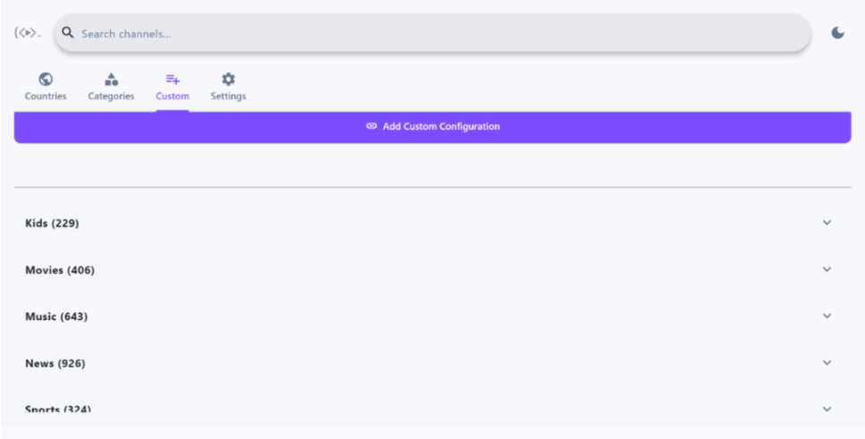

<p align="center">
  
</p>

<h1 align="center">KTV Player</h1>

<p align="center">
  A high-performance, cross-platform IPTV rendering engine and local media player built with Python and Flet.
</p>

<p align="center">
  
  
  <br>
  
</p>

---

## Download

| Platform | Download | Notes |
|:--------:|:--------:|:------|
| 🤖 **Android (Universal)** | [**ktv.apk**](https://github.com/Nwokike/ktv-player/releases/latest/download/ktv.apk) | Works on all Android devices (ARM64, ARMv7, x86_64) |
| 🤖 **Android (ARM64)** | [**ktv-arm64-v8a.apk**](https://github.com/Nwokike/ktv-player/releases/latest/download/ktv-arm64-v8a.apk) | For modern 64-bit Android devices |
| 🤖 **Android (ARM32)** | [**ktv-armeabi-v7a.apk**](https://github.com/Nwokike/ktv-player/releases/latest/download/ktv-armeabi-v7a.apk) | For older 32-bit Android devices |
| 🤖 **Android (x86_64)** | [**ktv-x86_64.apk**](https://github.com/Nwokike/ktv-player/releases/latest/download/ktv-x86_64.apk) | For Android emulators / ChromeOS |
| 🪟 **Windows** | [**KTV_Player_Setup.exe**](https://github.com/Nwokike/ktv-player/releases/latest/download/KTV_Player_Setup.exe) | Windows 10/11 Installer (64-bit) |

---

## Screenshots

### Desktop & TV Experience

<p align="center">
  
</p>
<p align="center"><em>Your home country channels load first — live indicators show stream status in real time</em></p>

<p align="center">
  
</p>
<p align="center"><em>Instant search across all channels — find Al Jazeera EN and AR feeds in one keystroke</em></p>

<p align="center">
  
</p>
<p align="center"><em>Add custom playlists or single channels</em></p>

<table>
  <tr>
    <td></td>
    <td></td>
  </tr>
  <tr>
    <td align="center"><em>Browse by category — News, Business, Kids</em></td>
    <td align="center"><em>Explore regional collections worldwide</em></td>
  </tr>
</table>

<table>
  <tr>
    <td></td>
  </tr>
  <tr>
    <td align="center"><em>Custom library — your personal channel collection</em></td>
  </tr>
</table>

### Mobile Experience

<table>
  <tr>
    <td width="50%"></td>
    <td width="50%"></td>
  </tr>
  <tr>
    <td align="center"><em>Compact mobile layout with live stream indicators</em></td>
    <td align="center"><em>Full dark mode — easy on the eyes for late-night watching</em></td>
  </tr>
</table>

---

## Features

- **Local Video Library** — Automatically scans your device for all video files organized by folder. Respects `.nomedia`. Supports MKV, MP4, AVI, WebM, MOV, FLV, WMV, and more.
- **Open With KTV Player** — Register as the default video player on Android. Tap any video file and choose KTV Player.
- **Real-Time Stream Indicators** — Green/red dots validate streams in batches. Results cached with TTL eviction.
- **Smart Categorization** — Auto-groups channels by Country and Category from playlist metadata.
- **Custom Playlists** — Add any M3U8 URL or single stream. Stealth shortcodes for curated collections.
- **TV Remote Ready** — D-pad navigation with visible focus highlights and color transitions. Built for Android TV and Fire Stick.
- **Dark/Light Mode** — System-aware theme with Glassmorphism UI and premium color palette.
- **Offline-First** — 24-hour playlist cache. WAL-mode SQLite with NORMAL synchronous for instant history and favorites.
- **Deep Link Support** — Launch directly into any stream via `ktv://play?url=<base64>` from other apps.
- **Auto-Retry** — Failed streams automatically retry up to 3 times.
- **Multi-Format Playback** — MKV, HLS (.m3u8), DASH (.mpd), MP4, and more via libmpv.

## Architecture

| Layer | Technology |
|-------|-----------|
| Frontend | Flet (Python → Flutter) |
| Video | `flet-video` (libmpv) — MKV, HLS, DASH, MP4, AVI, WebM, MOV, FLV, WMV |
| Database | `aiosqlite` (async SQLite, WAL mode, NORMAL sync) |
| Network | `httpx` (async, connection pooling, limits) |
| Liveliness | TTL-bounded cache (500 entries, 5-min expiry) |
| Local Scan | `pathlib` recursive walk with `.nomedia` support |

## Local Video Playback

KTV Player now plays videos stored on your device. The Local tab automatically discovers all video files across your device storage, grouped by folder — just like MX Player.

**Supported formats:** MKV, MP4, AVI, WebM, MOV, FLV, WMV, M4V, 3GP, MPEG, MPG, TS, M2TS, OGV, RM, RMVB, VOB, F4V, ASF, DIVX, XVID

**Open With:** On Android, you can set KTV Player as the default video player. When you tap a video file in any file manager, KTV Player will appear as an option.

## Deep Link Integration

KTV Player can be launched from other apps via deep links:

```
ktv://play?url=<base64-encoded-stream-url>
```

Example from another Flet app:
```python
encoded = base64.urlsafe_b64encode(stream_url.encode()).decode()
await page.launch_url(f"ktv://play?url={encoded}")
```

## Legal Disclaimer

KTV Player is a network utility and media player. It includes a built-in directory of publicly available, legal, free-to-air broadcasts. It does not contain, host, or distribute any copyrighted premium media. Users are solely responsible for ensuring they have the legal right to access any third-party networks they manually configure via the custom playlist integration.
