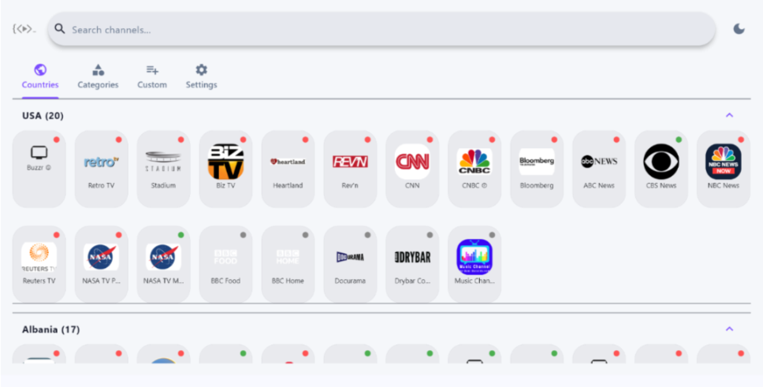
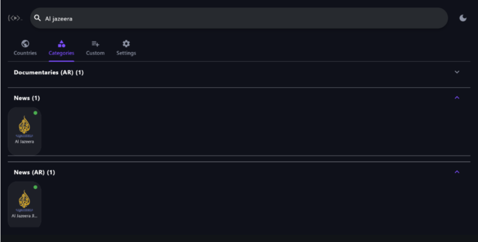
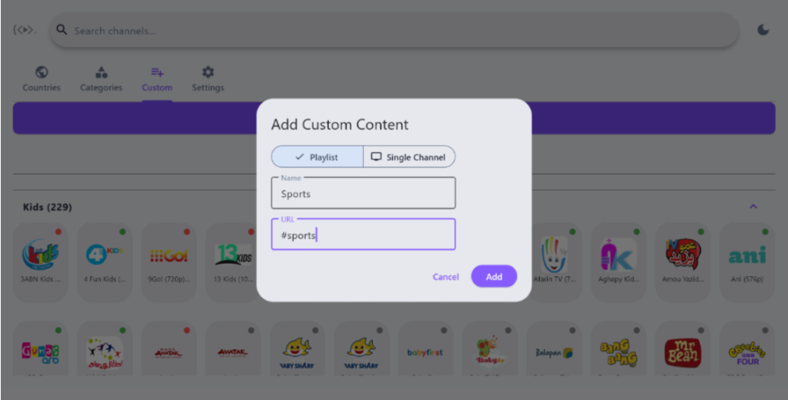
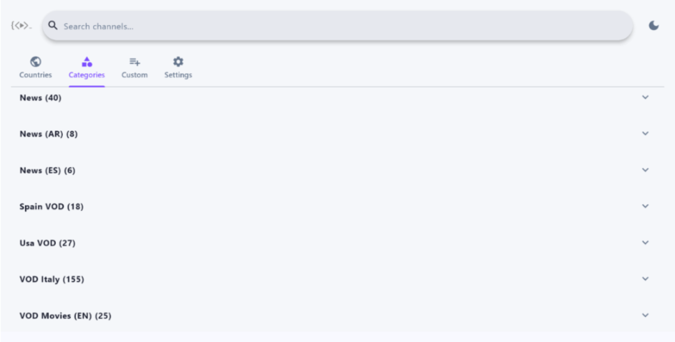
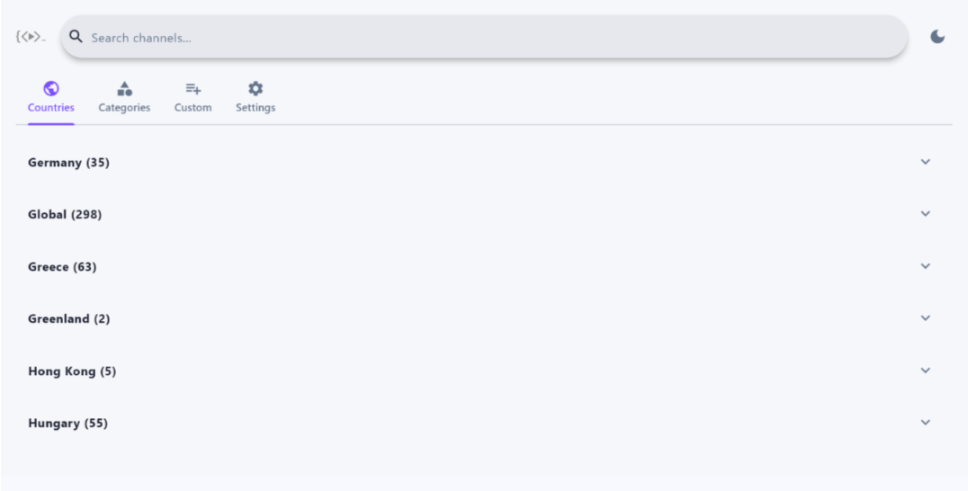
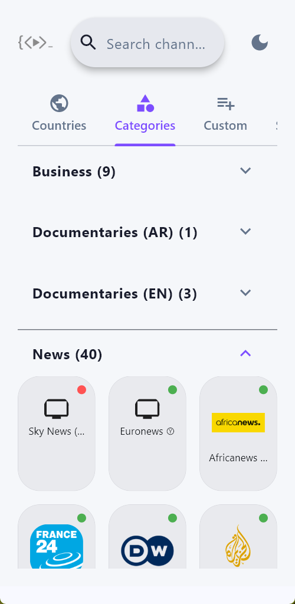
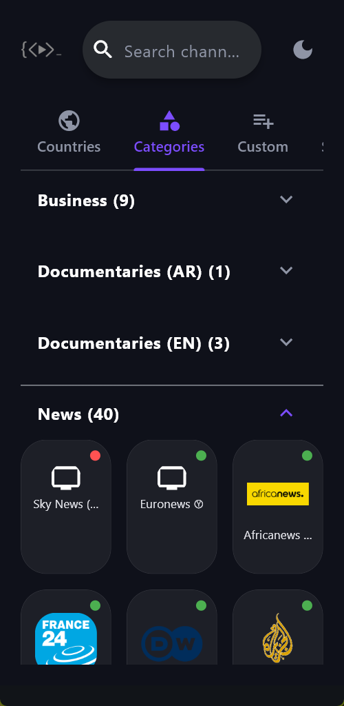

<p align="center">
  
</p>

<h1 align="center">KTV Player</h1>

<p align="center">
  A high-performance, cross-platform IPTV rendering engine built with Python and Flet.<br/>
  Handles massive M3U8 playlists with zero-lag virtual scrolling and real-time stream validation.
</p>

<p align="center">
  <a href="apk/KTV.apk"><strong>📥 Download for Android (Universal APK)</strong></a><br/>
  <sub>Supports all Android architectures — ARM64, ARMv7, and x86_64 in a single build.</sub>
</p>

---

## Screenshots

### Desktop & TV Experience

<p align="center">
  
</p>
<p align="center"><em>Your home country channels load first — live indicators show stream status in real time</em></p>

<p align="center">
  
</p>
<p align="center"><em>Instant search across all channels — find Al Jazeera EN and AR feeds in one keystroke</em></p>

<p align="center">
  
</p>
<p align="center"><em>Add custom playlists or single channels</em></p>

<table>
  <tr>
    <td></td>
    <td></td>
  </tr>
  <tr>
    <td align="center"><em>Browse by category — News, Business, Documentaries, Kids</em></td>
    <td align="center"><em>Explore VOD libraries and regional collections</em></td>
  </tr>
</table>

### Mobile Experience

<table>
  <tr>
    <td width="50%"></td>
    <td width="50%"></td>
  </tr>
  <tr>
    <td align="center"><em>Compact mobile layout with live stream indicators</em></td>
    <td align="center"><em>Full dark mode — easy on the eyes for late-night watching</em></td>
  </tr>
</table>

---

## Features

- **Virtual-Scrolled Grid** — Only visible channels are rendered. A 300-channel group loads as fast as a 10-channel group.
- **Real-Time Stream Indicators** — Green/red dots validate streams in batches. Results cached per session — no redundant checks.
- **Smart Categorization** — Auto-groups channels by Country and Category from playlist metadata.
- **Custom Playlists** — Add any M3U8 URL or single stream. Stealth shortcodes for curated collections.
- **TV Remote Ready** — D-pad navigation with visible focus highlights. Built for Android TV and Fire Stick.
- **Dark/Light Mode** — System-aware theme with Glassmorphism UI.
- **AdMob Integration** — Non-intrusive anchor banners and interstitials.
- **Offline-First** — 24-hour playlist cache. WAL-mode SQLite for instant history and favorites.

## Architecture

| Layer | Technology |
|-------|-----------|
| Frontend | Flet (Python → Flutter) |
| Video | `flet-video` |
| Database | `aiosqlite` (async SQLite, WAL mode) |
| Network | `httpx` (async, connection pooling) |
| Ads | `flet-ads` (Google AdMob) |

## Quick Start

```bash
git clone https://github.com/Nwokike/ktv-player.git
cd ktv-player
uv sync
uv run flet run src/main.py
```

## Build

```bash
# Android APK
flet build apk

# Windows
flet build windows
```

## Legal Disclaimer

KTV Player is a network utility and media player. It includes a built-in directory of publicly available, legal, free-to-air broadcasts. It does not contain, host, or distribute any copyrighted premium media. Users are solely responsible for ensuring they have the legal right to access any third-party networks they manually configure via the custom playlist integration.